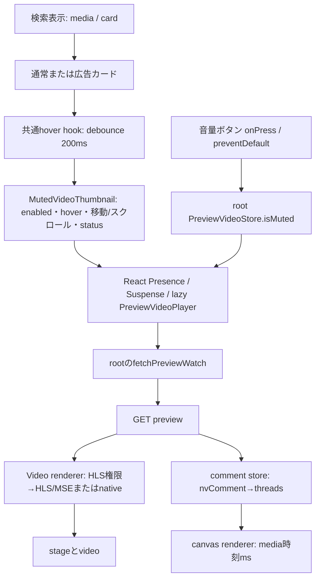

# 検索カードの動画・コメントホバーと音量：実装引継ぎ

2026-09-20 JST。**保存版の公式コードで、検索リスト／タイル・広告カード→プレビュー→映像／コメント取得まで接続できた。現在の実ブラウザでの同等性は未確認。** 本体・ZenzaWatchを変更していない。実装するなら、公式カードを保持する単位とNG追加カードへ独自の寿命管理を与える単位を分ける。

最初に[既存資料の到達点](HOVER-PREVIEW-PRIOR-EVIDENCE.md)を参照。今回の保存公式JSは2026-09-13の提供通信記録由来であり、2026-09-20の現行配信版とは主張しない。研究branchは `codex/research-hover-preview`、基点は `352b676325b3559b73eb93f8560e1b76bdbe89a7`。既存研究worktreeはそのまま残した。

## 根拠の区分

| 区分 | 今回の範囲 |
|---|---|
| 実ブラウザ観測 | **0件**。サイト安全ポリシーが接続を拒否。ホバー・クリック・再生・設定操作は未実施 |
| 実通信の保存記録再確認 | 新規通信0。preview 60件の状態等、選択したpreview/HLS/コメントの項目・等値判定。現在の通信ではない |
| 静的コード確認 | 保存公式JS15ファイルの選択経路、利用者指定Zenza checkoutの対象6ファイル |
| 合成実行 | 指定Zenzaのsourceとdistの関数部分を偽通信・合成データで各7ケース実行し、出力一致。ユーザーDB読取0 |
| 他者報告 | 20260917のstoryboard取得・広告owner補完。今回独立再現なし |
| 提案・仮説 | NG用状態機械・通信予算・破棄条件・受入テスト。公式仕様や実装済み機能ではない |

証拠：[固定出典・コード内位置](evidence/hover-preview-fixed-sources-20260920.json)、[保存通信の許可項目](evidence/hover-preview-historical-20260920.json)、[合成結果](evidence/hover-owner-offline-20260920.json)。第三者コード全体・原HTML・HAR・署名・キー・実ID・投稿者名・検索語は今回の差分に収録しない。

## 公式保存版で追えた所有関係と状態遷移

`SearchVideoListSkeleton-DnEPDg6a.js`の検索結果は通常・広告、media・card分岐で`isPreviewVideoEnabled:true`を渡す。タグページの結果componentから接続を確認した。キーワード検索ルート自身の全呼出経路は未監査で、共通componentの存在から全検索条件へ一般化しない。

通常カードは動画model、広告カードはcontentId・thumbnail・latestComments等から別modelを作る。広告のクリック遷移にはredirectのfetchによる計測があり、通常カードと同じ無副作用リンクとは扱わない。広告カードをクリックする観測は行わなかった。

保存版の流れ：`idle → loading → playing → ended`。取得結果なしは`unavailable`、mediaイベントは`error`、キャッシュのabortは`aborted`。離脱時に親はhoverをfalseにし、Presenceが退場・unmountする。再hoverでは親statusをloadingへ戻し得る。状態名の存在はすべての失敗を漏れなく通知する保証ではない。

| 項目 | 静的確認 | 実測・不足 |
|---|---|---|
| 開始待ち | カードhover hookはdocumentのmouseover/mouseleaveを監視し200ms debounce。スクロール400ms、マウス移動50msの追加gate | 200msが初映像までの時間ではない。ネットワーク・lazy import・buffer待ちを含む実時間は未測定 |
| 準備待ち | コメント開始前のready待ち2秒、stage側ready待ち5秒、再生時刻>0の待ち3秒という上限引数 | 秒数を固定遅延・正常な開始保証・合計10秒と解釈しない |
| 区間 | maxDuration既定30秒。stage設置後setCurrentTime(0)。自然終了またはcurrentTime>=上限で終了・pause | 現在の実区間、短動画、境界超過量、全呼出元のoverrideは未確認 |
| ループ・シーク | preview用memory設定のloop既定false。進行バーinteractive:false | 通常視聴のloop設定やシーク用storyboardをそのまま一覧へ適用しない |
| 離脱 | unmountでpause・stage除去・イベント解除。資源は下記キャッシュ寿命と別 | 離脱と同時に全通信停止・即disposeとは断定できない |
| 再訪問 | moduleのPromise cacheにsize:3。depsはwatchIdとonStatusChanged。使用時に前へ移動、pendingがなくなると末尾をabort | 動画IDだけの3件cacheでも、同時再生最大3でもない。callback identity、再mount、hit率、TTLは未実測 |
| 複数カード | hoverは各カードrefで判定。preview cacheと共有muteは別の機構 | 素早い移動・退場animation中の重複、同一ID複数箇所の実挙動は未確認 |
| 画面外・hidden | この経路でviewport外やdocument.hiddenを直接pauseへ接続する保証は未発見。共通schedulerにvisibility処理はある | schedulerの存在だけで「背景で停止」としない。スクロールgateも再生中を許す条件がある |
| SPA | React unmountとcleanup、共有root store、module cacheが関与 | 戻る・BFCache・root再生成、abort時点、再通信数は未実測 |

## 映像API／データ契約

次表のheaderは**コードまたは標本にある名称**で、最小必須集合を実験した結果ではない。ブラウザが管理するCookie/Origin/Referer等をNGから偽装しない。

| 段階 | method・endpoint／要求 | 応答・認証・期限・失敗 |
|---|---|---|
| preview | GET `nvapi.nicovideo.jp/v1/watch/{videoId}/preview`。query actionTrackId。生成clientにはi18nLanguage/prevIntegratedLoudness/additionalsもあるが本呼出はwatchId/actionTrackId | `meta.status`、`data.video.duration:number`、`domand`、`comment`、`player`、`system`。保存60件はCookieあり・Authorizationなし、59件200/1件403。ログイン必須／不要は未検証 |
| preview headers | Accept、X-Frontend-Id、X-Frontend-Version、X-Niconico-Language。汎用clientは条件でX-Client-Os-Type、credentials:include | 成功・失敗各1標本はOrigin一致許可、allow-credentials:true、Cache-Controlのprivate/no-cache。403の原因は未確定。wrapperは例外を吸収してundefinedを返す |
| 再生権限 | POST `nvapi.nicovideo.jp/v1/watch/{videoId}/access-rights/hls`。query actionTrackId、JSON `{outputs:string[][]}` | `data.contentUrl:string`、`createTime:string`、`expireTime:string`。映像URLはメモリ内のみ。キー／Cookieの要否の比較・期限切れ再現は未実施 |
| HLS headers | 上記nvapi共通項目＋Content-Type、Accept、X-Request-With、X-Access-Right-Key | 選択した保存標本は201、同一watch ID・previewのaccessRightKeyとの一致を確認。Set-Cookie項目あり、値は記録しない。Origin一致・allow-credentials:true、private/no-cache |
| 配信 | contentUrlをHLS loaderへ。HLS.js対応時attachMedia→loadSource→manifest→segment→SourceBuffer/MediaSource→video。非対応時native video.srcへ渡す分岐 | HLS経路はxhrSetupでwithCredentials:true。実際のmanifest/segmentのCORS・Cookie条件・期限・要求数は今回未確認。権限APIのCORSからCDN成功を推定しない |

品質はavailableなvideo/audioの組を作り、previewでは通常高さ360以下、shortでは640以下の候補を優先する。該当なしでは元の候補へ戻るため「必ず360以下」ではない。bufferLengthLimitへmaxDurationを渡し、FRAG_BUFFERED時にbuffered範囲の合計が上限超過ならloadingを止める。bytesや厳密な30秒分の上限保証ではない。

**blobはローカルMediaSource等への参照で、preview APIのURLではない。** 保存コードのHLS実装にはMediaSourceをcreateObjectURLしてvideoへ結ぶ箇所がある。worker/画像にもcreateObjectURLがあるため単語一致だけで生成元を断定しない。提供DOMの特定blobがこのHLS分岐から生成されたかは、実ブラウザのinitiator照合が必要。署名URLの形・token payloadは解析／公開していない。

期限はHLS権限応答にexpireTimeがあるところまで。約3時間というstoryboard報告をHLS・preview・threadKeyのTTLへ流用しない。HTTP cacheのprivate/no-cache、moduleのPromise cache、MSEのbuffer、キーcacheは別々に管理する。

## コメントの取得・時刻・描画

保存`PreviewVideoPlayer`はpreview応答をcomment watch modelへ変換し、store初期化→NG score設定→AIコメント非表示→ユーザーNG有効→通常読取を呼ぶ。`comment.nvComment.threadKey`をvideoId別のキーMapへ入れ、`params`を使って`server + /v1/threads`へPOSTする。additionalsはこの呼出では空で、過去ログ全件取得を起動する経路ではない。

| 項目 | 確認と限定 |
|---|---|
| 要求 | `params.targets:[{id:string,fork:string}]`、`params.language:string`、`threadKey:string`、`additionals:object`。query pc。header X-Frontend-Id/Version、X-Client-Os-Type。fetchはcredentials:omit、cache:no-store |
| Content-Type | 保存Web要求はJSON文字列本文にtext/plain系。コードがContent-Typeを明示しないことと矛盾しない。標本のheader値全体は出力しない |
| 認証 | CookieなしでもthreadKeyあり。preview側のログイン状態・権限から独立した匿名取得保証ではない |
| 保存記録の照合 | 選択previewとHLSのwatch ID/key一致、別のコメント要求とthreadKey/params一致。コメント応答は3 thread・242要素。後者が同じホバー操作に属する証拠ではない（同じキーの再利用があり得る） |
| 応答 | meta.status、data.threads[].id/fork/commentCount/comments、globalComments等。id/forkでpreviewのthread定義と照合して変換する |
| エラー | 保存コードはEXPIRED_TOKEN時にキーを強制更新し1回再試行。他のエラーはthrow。現在の成功条件・キー寿命・NG追加カードでの採用は未検証 |
| CORS | 選択したコメント応答のallow-originはwildcard、allow-credentials:trueではなかった。Cookieなしの当該標本の条件に限定し、nvapiのcredentials:includeとは分ける |
| 件数 | canvas用コメントの5件上限や30秒範囲だけのサーバー要求は確認していない。242は一標本の受信件数で画面内件数ではない |
| 別の簡易表示 | preview無効時はlatestCommentSummaryを空白分割し最大5要素のspanにする別経路。取得済み要約とnvComment canvasを混同しない |
| 描画 | 共通rendererを`useWebGL:false,resolution:2`で生成しcomment領域へ置く。時刻は`media.getCurrentTime()*1000`。元のvposMsを保持し、0秒開始に重ねる経路 |
| preview固有処理 | サイズ・字体等の指定commandがないコメントにbigサイズを与えるstaging filter。通常視聴のサイズを丸ごと流用できない |
| 同期・シーク | rendererはmedia時刻を参照。layer作成・差分patch、duration更新、ResizeObserverがある。previewのシークUIは非interactive。seek後の実画面の再配置・残像は未実測 |
| 重なり・衝突 | 今回公式rendererの全衝突アルゴリズム・pixel結果・字体を検証していない。R15A/Bは別OSSの合成矩形であり公式の衝突仕様にしない |
| 破棄 | renderer/storeはdisposeへ接続。ただしpreview cacheがrendererを保持し、unmountはpause/stage除去で終わり得る。離脱時の即全破棄は保証しない |

## 音量とイベント

rootの`PreviewVideoStore`は`isEnabled`をlocalStorageから読み、`isMuted:true`で初期化する。toggleMutedは共有store内の値だけを反転し、その関数内では永続保存しない。プレビューのミュートボタンは`onPress`で`preventDefault()`→toggleMuted。`useSyncExternalStore`で各サムネイルが購読し、player effectがsetMutedへ渡す。親リンクもdefaultPreventedを確認するため、ボタン操作を通常の視聴遷移から切り離す構造がある。stopPropagationを呼ぶとまでは確認していない。

音量の数値はrendererのlocalStorage設定からgetVolumeで読み、preview自体はmemoryStorageを使用する。ボタンはミュート切替であり、今回のカードコードに連続音量スライダーは確認していない。カード間ではmute共有、同じmoduleを保つSPAでは残る可能性、フルreloadは初期ミュートという静的帰結がある。別タブ・ブラウザ再起動・通常視聴側で変えた値の反映タイミングは未確認。

音声を有効化するユーザー操作があってもplay成功を保証しない。NGではplay Promiseの拒否を受け止め、無音または停止表示へ戻し、クリック等の明示操作を待つ。ブラウザ設定変更、無音音源等を使う自動再生制限の回避は実装しない。

公式にはpreview-playのbeacon、音声・状態条件から再生数更新を呼ぶ経路もある（分岐順による実到達は未確認）。ユーザーの「副作用を伴う操作をしない」に従い今回送信していない。NGで公式内部componentを直接呼ぶ案は、これらの処理も含むため安易に採用しない。

## DOM契約と本体への組込み境界

[合成fixture](evidence/hover-preview-synthetic-fixture-20260920.json)は構造のみ。stage→inner→contentの下にvideo-content・overlay-icon・storyboard-content・supporter-content、inner内の別層にcomment/canvasを置く。提供断片ではcommentのpointer-events:noneにより操作を透過し、映像とコメントの重ね合わせがある。寸法・canvas解像度は固定要件ではない。`vsc-controller`は由来未確認のため公式要件へ含めない。

outerHTMLにはReactのprops/ref/購読・イベント登録・Promise cache・fetch結果・MSE buffer・canvasの描画内容が入らない。muted/volume/currentTime等のpropertyも文字列属性だけで再現できない。blob文字列だけ複製しても再生資源の所有と寿命は移らない。

| 対象 | 最小の変更方針（提案） |
|---|---|
| 公式既存カード | nodeとReact管理を保持。非表示・並べ替え時も可能なら置換/cloneを避ける。元のリンク・メニュー・ミュート・広告計測のイベントを上書きしない。既存playerへ二重登録しない |
| NGがHTMLから追加したカード | 自動追加という出自をNGの管理情報で識別。外観は合成構造から作り、独自controllerが通信・canvas・音量・cleanupを所有。React非公開fiberを移植しない |
| 同じ動画の別カード | videoIdはデータキー、cardInstanceIdは描画先。両者を分離し、同一DOMへ重複attachしない |
| NG非表示・削除 | controllerを先に停止。NG判定unknownと再生不可を同じ状態にしない。owner/tag補完をホバー開始に不要に連結しない |

## NG用の状態・データ契約（設計提案）

`idle → hoverPending → loading → ready → playing → ended` を基準とし、`blocked/error/unavailable`と`disposed`を分離する。muteはこの状態列と独立のboolean。全非同期結果に`pageGeneration/cardInstanceId/videoId/attemptId`を照合し、古い結果は描画へ渡さない。

メモリ内のPreviewSessionには、識別子、phase、mute、volume（0〜1）、media現在秒、preview上限秒、AbortController、media adapter、comment renderer、解除関数を持たせる。API由来データにはsource、取得日時、明示されたexpiryと項目別unknownを持つ。期限不明のキーを永続化しない。media権限、owner、コメント、NG判定を1個の「取得済み」にまとめない。

提案する破棄条件：hover離脱、別カードの再生権取得、画面外、document.hidden、SPA世代変更、カード除去・NG非表示、ID差替え、終了、失敗。timer取消→自分のfetch abort→pause→HLS loading停止/renderer破棄→canvas消去→object URL revoke→observer/listener/animation解除の順で、自分が所有するものだけ処理する。中断後に返るPromiseも世代照合で捨てる。公式カードのURLをNG側でrevokeしない。

再訪問は初期時点へ戻す案を基準とし、メディアcache再利用は別単位にする。hidden復帰は勝手に音付き再生せず再hover/明示操作待ち。BFCache pagehide/pageshowも検証する。これらは保存公式版の完全な模倣ではなく、NG用の保守的な提案。

## 通信予算案

- 一覧表示・hover待ち取消・NG非表示カード：追加0。全ページのpreviewやコメントを先読みしない。
- 1個の安定hover：最大1 sessionをactiveにする。cacheなしの候補はpreview 1 GET＋権限1 POST＋コメント1 POST＝制御API3要求。lazy JS、OPTIONS、manifest/segment、鍵取得、計測は別枠であり「全通信3回」ではない。
- キー期限切れ：将来確認後に限り、キー更新1 GET＋コメント再試行1 POSTを上限候補とする。401/403/429、非公開、未対応、認証要求は停止。自動無限再試行なし。
- 初期実装では同時media1、同時comment1、先読み0、履歴取得0。再hoverの重複要求を1つに束ねるが、視聴者条件と取得種別を分ける。
- mediaは30秒というコード上の目安だけで通信量上限を保証しない。実測後に時間・bytes・segment数の打切りを調整。権限responseを全動画100件へ広げない。

## 指定Zenza版：名前・アイコン補完

利用者指定checkoutのcommit `27674297960fbd73bde8512e57300448d85ebdd3`、branch develop、distのversion `2.7.21-task081`を固定した。対象6ファイルのhashを台帳へ記録。未確定の別artifact変更を保持した。ブラウザに実際に導入されたbytesとの一致は確認していないため「指定ローカル版」と呼ぶ。従来のkphrx公開派生版とは別の根拠。

`VideoInfoLoader.resolveMissingOwner`→`VideoInfoModel.owner`の経路：

1. channelInfoがある、または通常視聴のuploaderInfo.idがある場合は補完を行わない。ID既知で名前・画像だけ欠けてもこの関数では追加取得しない。
2. 対象動画形式を検査後、広告単独情報を取得。同一動画IDとownerIdを確認し、ownerName/ownerIconを採用する。
3. ownerIdがなければsnapshotのuserIdを試す。広告のownerIdだけ取れた場合に名前・アイコンをsnapshotで埋める流れではない。
4. 名前・アイコンが未取得ならmodelの表示用defaultへ進む。確認したgetterは過去cacheのowner.name/iconへフォールバックしない。

`OwnerSupplement.supplementThumbInfo`は別経路で、thumbInfo.ownerがあればskipし、なければ広告情報→表示用placeholder。これを通常視聴の優先順と混ぜない。ソース内の「退会」等のコメントは利用者の状態の確定証拠とはしない。

WatchInfoCacheDbは新しいvideoInfoがあればそのmodel全体を保存し、なければ古いvideoInfoを残す。ownerId indexだけ古い値を残す分岐があっても、表示名をcacheから補完する証明にはならない。getはupdateTimeを呼ぶのでread-onlyと扱えず、updatedAtは取得時刻ではない。実DBは読んでいない。

7ケースの[合成実行](evidence/hover-owner-offline-20260920.json)で通常owner保持、名前だけ欠落、広告採用、動画不一致、広告の名前画像欠落、全取得失敗、channelを確認。sourceとdistから別々に抽出した関数の7ケース出力は一致した。古いcacheの名前画像を意図的に与えても、この抽出経路では選ばれなかった。モデル全体や全UIの実ブラウザ再現ではない。[診断](tools/probe_hover_owner_offline.py)は固定hashを照合し、偽通信だけで実行する。

## 最小の実装単位と受入テスト

| 単位 | 内容 | 受入条件 |
|---|---|---|
| 1 | 公式カード保持とNG追加カードの識別、lifecycleのみ | 元カードのhover・リンク・音量・メニュー維持。追加カード以外にcontroller0。二重attach0。preview通信0 |
| 2 | 追加カード1件の無音映像adapter | hover取消0要求。1安定hoverだけ取得。終了/離脱/NG非表示で停止。API契約/CORS/認証を許可環境で確認するまで本番有効化しない |
| 3 | 明示操作のmute/volume | 初期mute、buttonで視聴遷移なし。play拒否から回復可能。keyboard/フォーカスを検証。元設定を意図せず変更しない |
| 4 | コメントadapter | vposMsとmedia秒の対応、0秒/終了境界、遅延到着時同期、emptyとfailureの分離。件数制限・衝突方針を明示して実画面で確認 |
| 5 | 必要なら有限cache | session条件と期限を保持、失敗Promiseを永続化しない。cache hitでも世代違いに描画しない。削減数はモックと実測を分ける |

回帰テスト一覧：短動画／30秒超／media unavailable／403／429／timeout／破損JSON／CORS失敗／play拒否／empty comments／コメントのみ失敗／離脱中のresolve／A→B→A／同じIDの2カード／画面外／hidden→visible／SPA→戻る／DOM再利用とID差替え／resize／高DPI／マウスからボタンへの移動／タッチ端末でhoverなし。解除後の要求・listener・timer・media・canvasの残存を検査する。仕様を模しただけのモックを公式との一致証拠にしない。

## 未確認・引継ぎの境界

公式現行版の初フレーム時間、実区間、複数hover、画面外/タブhidden、SPA/BFCache、認証の最小条件、header必須集合、キー/署名の期限、CDN CORS、実コメント件数と衝突、音量の再起動・別タブ保持、現在のキーワードルート、導入userscriptとのbytes一致が未確認。実ブラウザの拒否を回避して埋めない。[閲覧者確認票](HOVER-PREVIEW-OBSERVATION.md)の少数観測だけを次へ渡す。

今回の資料は実装を開始する境界を明確にするもの。公式と同等のホバーが実装・検証できたとの完了報告ではない。
