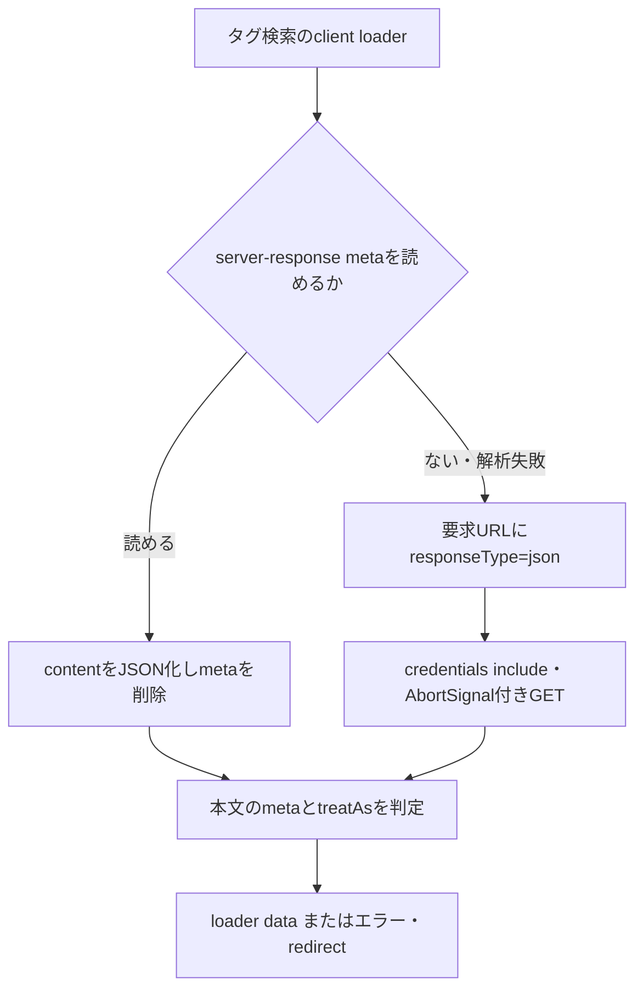

# 検索の初期データとSPA遷移：NG向けの寿命整理

R06、2026-09-20。**現在配信されているタグ検索loaderは初期metaを読み取った後に削除する。以後はroute JSON取得へ進むコードになっている。** 検索へshortsのキャッシュ寿命を流用する根拠はない。これはCONFIRMED-CODEで、現在ブラウザの遷移通信を観測した結果ではない。

## 版と確認方法

R05で取得した初期HTMLの公開manifest/bridge参照を使い、manifestとbridge、タグ検索client loaderの3ファイルだけを認証なしで読み、静的に追跡した。サイトでのブラウザ実行は安全ポリシーにより拒否されたため行っていない。公開コードの読み取りは画面の間接実行ではなく、保存済み記録と同様の静的確認に限定した。

| ファイル | SHA256 |
|---|---|
| manifest-baf86e63.js | dc201c75ea8092effb68bf7e96c410fbd3fe3a8ed71b7fe4317898a5398262fb |
| bridge-D5WxNeTE.js | 5086fbbd033a8421683c2f9c27cb8b62ffb2b9494a4710f5708c9e46719eda2d |

タグ用loaderのURL/hashと全確認時刻は[証拠台帳](evidence/spa-lifecycle-code-20260920.json)。manifestの`tag/:keyword/*`→`_web._search.tag._keyword._-client-loader-DiqV1NRJ.js`→bridgeのexport s→Biという対応を確認した。コードを大量転載せず処理の要約を残す。作者はニコニコ公式Webクライアント開発者、対象はWeb nvpc_next。公開ソース取得3 GETで、動画情報APIの追加試験は0。

## 1経路：タグ検索の初回表示からページ送りへ

経路図は静的コードの制御フロー。実行時系列や全ページでの保証ではない。要求URLのpage/sort/order等は元のURLから引き継がれ、hostを設定されたoriginのhostへ合わせ、responseTypeをjsonへ設定する。bodyなし。公開routeにcredentials includeと書かれていてもログイン必須とは言えない。

初回metaを後からDOM検索して見つからなくても、初期HTMLになかったとは判断できない。今回R05はHTML応答の32 ownerを確認したが、userscriptが消費前に取得できるかは別の実装・実測条件になる。

`Vi`はfetchのTypeErrorかつ未abort時に最大2回再試行し、200/400 ms待つ。初回は_retryを削除し、再試行は_retry=1/2。HTTP 4xx/5xxだけでfetchがTypeErrorを投げるわけではない。JSON本文meta.status/meta.code、data.treatAs、redirect条件は別に判定される。現在の実通信が常に1回という保証にはしない。

## キャッシュについて分かったこと・分からないこと

bridgeの`zi`は任意のcreateCacheKeyを受け取る別factory。Promise/url/timestampを保存し、同じkeyならPromiseを再利用、reject時は削除する。tidyのmaxCount/lifetimeMs、removeIfを呼び出す側が条件を与える。**今回のタグ検索loaderはこのfactoryではなくBiを直接使う。**

従って、旧shorts解析にあったpathnameキーや600秒を一般検索の仕様にしてはいけない。一方、React Routerの別キャッシュ・戻る操作・ブラウザHTTPキャッシュまで存在しないと断定する証拠でもない。実際の戻る再取得回数や破棄時刻は未確認。

## NGスクリプト側の設計条件（提案、実装未検証）

- 初期データの読取は公式のmetaを削除・変更せず、必要なvideoId/owner/tag等だけをコピーする。meta全体の永続保存やログ出力は避ける。
- 後続のroute応答を既取得情報として利用する設計なら、元のresponse/bodyを消費し切ったり書き換えたりしない。ページ側の処理と両立する方法は対象userscript管理環境で別に検証する。
- pageKeyはpathnameだけでは不足。タグ/キーワード・page・sort・order等、表示結果へ影響するqueryを含める。ログイン・フィルター変更で変わる範囲も分離する。
- 画面更新の世代番号とvideoIdを一緒に照合する。古い世代の非同期応答を現在DOMへ適用しない。同じvideoIdのメタデータキャッシュへ入れる場合もsource/時刻を保持する。
- 要求重複を抑えるなら、情報種別を含むin-flight keyを使い、失敗Promiseを成功値として残さない。owner取得成功とタグ取得成功は別状態にする。
- タグ等が未確定な行はpending/unknownを保ち、既知の項目だけでルール上確定できる時だけ判定する。実測していないTTLを固定値で推奨しない。

## 再確認と終了

同じ公開asset URLのhashを確認し、変わった場合はmanifestのloader参照から追い直す。現在の不足は、通常ページ送り1回/戻る1回のruntime観測、meta消費前の取得可否、実行世界、CORS。ブラウザ操作を別手段で回避する試験はしない。

R06は静的解析として終了し、実遷移の検証は保留する。R07のブラウザ呼出検証も同じ環境では実行不能なので、その範囲を明記してR08の実装引き渡しへ進む。[初期データ](BROWSER-DATA-REUSE.md)、[次作業の指示文](NEXT-TASK-PROMPTS.md)。
